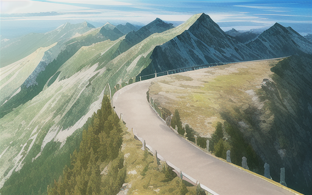
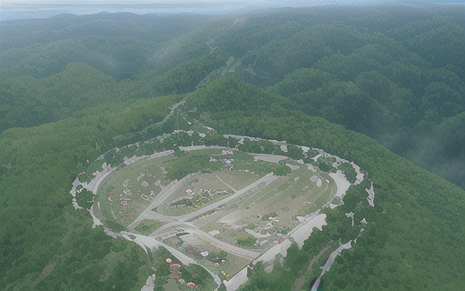

Think of a box with a mass $$m$$ on the ground, with some force $$f$$ applied to it. It can be the gravity
but also some external force applied on it like somebody pushing it. What happens to the box?
Your brain effortlessly gives you some possible answers to that question: it might stay in place, it might tip,
it might slide, it might be lifted up... All that depends on the force $$f$$. But how do we determine
what actually happens?

# The free box

Suppose first that the box is free (no obstacle or ground).
If its mass is $$m$$ and its inertia $$I$$, and it is subject to forces $$f_x$$, $$f_y$$ and $$\tau$$ (torque) 
the equation of motion can then directly be deduced from Newton's second law:

$$
\underbrace{
\begin{bmatrix}
f_x \\
f_y \\
\tau
\end{bmatrix}
}_{F}
=
\underbrace{
\begin{bmatrix}
m & 0 & 0 \\
0 & m & 0 \\
0 & 0 & I
\end{bmatrix}
}_{M}
\underbrace{
\begin{bmatrix}
\ddot x \\
\ddot y \\
\ddot \theta
\end{bmatrix}
}_{\ddot X}
$$

In this case, the acceleration is then $$\ddot X^{free} = M^{-1} F$$.

# Gauss' principle of least constraint

The presence of the ground introduces a *constraint* on our motion, in particular, the box
can't penetrate the ground, which will intuitively forbid the box to accelerate downwards.

As you can guess, this constraint will eventually result in extra forces that will end up in the
equation of motion, affecting our acceleration. But how do we compute those forces?
And how can we tell that the box will tilt or not?

We can here use a powerful tool:
[Gauss' principle of least constraint](https://en.wikipedia.org/wiki/Gauss%27_principle_of_least_constraint).
According to this principle, the true acceleration will be the one minimizing the following quantity:

$$
\begin{equation}
\begin{split}
\min_{\ddot X} \space (\ddot X - \ddot X^{free})^T M (\ddot X - \ddot X^{free}) \\
\text{with} \space \ddot X \space \text{subject to constraints}
\end{split}
\end{equation}
$$

# Unconstrained optimization

First things first, we can check what happens with this optimization problem if there is no constraint.
Substituing $$\ddot X^{free}$$ in the equation, the value to minimize becomes:

$$
\begin{equation}
\begin{split}
& (\ddot X - M^{-1} F)^T M (\ddot X - M^{-1} F) \\
& = (\ddot X^T - F^T M^{-T}) M (\ddot X - M^{-1} F) \\
& = (\ddot X^T M - F^T) (\ddot X - M^{-1} F) \\
& = \ddot X^T M \ddot X - 2 F^T \ddot X + F^T M^{-1} F
\end{split}
\end{equation}
$$

Since our optimization variable is $$\ddot X$$, the last term ($$F^T M^{-1} F$$) is constant and can be
ignored. The objective can then be rewritten as:

$$
\frac{1}{2} \ddot X^T M \ddot X - F^T \ddot X
$$

Mountain metaphor

How do we minimize such an equation? We will for that use a common metaphor:
imagine that you are on a mountain, and want to find the lowest point.

The mountain can be vast, and you
can't explore the whole of it, so there is no way to find this point for sure, you can however define a
<b>necessary condition</b> for a point to be the lowest: the slope of the mountain has to be locally flat at
this point (else, there would be a direction to get even lower).

In other words, the gradient of the objective has to be zero. In our case:

$$
\frac{\partial}{\partial \ddot X} \left( \frac{1}{2} \ddot X^T M \ddot X - F^T \ddot X \right) = 0
$$

That we can compute as:

$$
M \ddot X - F = 0
$$

Which will yeld $$\ddot X = \ddot X^{free} = M^{-1} F$$ as expected.
(Since our objective is quadratic, it only has one stationary point, which is the minimum.)

# Equality constrained optimization

Before considering the ground constraint, let's start with a simpler one:
suppose the box can't move up and down. Imagine it being on
some tracks, it can translate along the $$x$$ axis or rotate, but not move up and down along the
$$y$$ axis.

The constraint is then $$\ddot y = 0$$, which we can write in matrix form as:

$$
\underbrace{
\begin{bmatrix}
0 & 1 & 0
\end{bmatrix}
}_A
\ddot X = \underbrace{0}_b
$$

Mountain metaphor

This is an <b>equality</b> constraint. If you go back to the mountain metaphor, you can think of it as
the fact that you have to stay on a road. You now need to find the lowest point on the mountain
that can be accessed on that road.

The previous condition needs to be adapted, the slope
of the mountain doesn't have to be flat anymore, it is possible that the road simply prevents us from
getting any lower, because it is orthogonal to its slope.

In mathematical terms, this means that the gradient of the objective function has to be collinear to
the gradient of the constraint. This means that there is a scalar $$\lambda$$ such that:

$$
M \ddot X - F + \lambda A^T = 0
$$

This scalar is a new unknown called a **Lagrange multiplier**. Packaging everything together in a 
matrix, we can now rewrite our problem as:

$$
\begin{bmatrix}
M & A^T \\
A & 0
\end{bmatrix}
\begin{bmatrix}
\ddot X \\
\lambda
\end{bmatrix}
=
\begin{bmatrix}
F \\
b
\end{bmatrix}
$$

The matrix on the left is sometime referred to as the **KKT matrix** (for Karush-Kuhn-Tucker).
If we go back to our example where $$\ddot y = 0$$, the equation becomes:

$$
\begin{bmatrix}
m & 0 & 0 \\
0 & m & 0 \\
0 & 0 & I 
\end{bmatrix}
\begin{bmatrix}
\ddot x \\
0 \\
\ddot \theta
\end{bmatrix}
=
\begin{bmatrix}
f_x \\
f_y \\
\tau
\end{bmatrix}
+
\begin{bmatrix}
0 \\
\lambda \\
0
\end{bmatrix}
$$

In this equation, $$\lambda$$ has the unit of a force, and has to counter $$f_y$$ to cancel it out and enforce
the constraint. The beauty of this is: we start with geometrical **constraints**, and end up with
constraint **forces**.

# Inequality constrained optimization

Back to the original problem: will the box tip over? We can now answer this question by defining the
appropriate constraints:

* The box can't slide,
* The box can't penetrate the ground.

If we call $$A$$ and $$B$$ the left and right corners of the box, the non-sliding constraint can be defined
as $$\ddot x_A = \ddot x_B = 0$$.

However, the non-penetration constraint is trickier, since $$\ddot y_A = \ddot y_B = 0$$
would prevent the box from being lifted up.
What we need here is $$\ddot y_A \geq 0$$ and $$\ddot y_B \geq 0$$,
which are inequalities constraints. (Note that ensuring those constraints ensure that **all** the contact
points on the $$[A,B]$$ segment also have an upward acceleration.)

Mountain metaphor

Back again to the mountain metaphor, now think of the road as a parking lot, you can drive anywhere in it,
but can't cross its borders.

The lowest point of the mountain could be somewhere in this parking, which means a flat slope as in the
unconstrained problem, but it could also be on the border of the parking. This second case is kind of similar with
the road, with the difference that we need the slope to go lower outwards the parking (because, else, we
could go lower by going inwards which we are allowed to).

In mathematical terms, you then have two cases for each inequality constraint:

1. Either it is not limiting the optimal solution. To assess that, you could solve the problem without
  taking this constraint in account, and check that the optimal solution satisfies it.
2. Or it is indeed limiting the optimal solution , you can then treat it as an equality constraint, and
  check that the sign of the associated Lagrange multiplier is 
  positive for a $$\leq$$ constraint, or negative for a $$\geq$$ constraint.

Solving such a problem requires finding which inequalities are in case 1 or 2.
For quadratic objective functions and linear constraints, this 
work is efficiently done by [quadratic programming](https://en.wikipedia.org/wiki/Quadratic_programming) solver.

Having two inequalities for the box problem, we have four possible such combinations, that
all correspond to an intuitive physical outcome:

1. $$\ddot y_A > 0$$ and $$\ddot y_B > 0$$: the box is lifted up,
2. $$\ddot y_A > 0$$ and $$\ddot y_B = 0$$: the box is tilting to the right,
3. $$\ddot y_A = 0$$ and $$\ddot y_B > 0$$: the box is tilting to the left,
4. $$\ddot y_A = 0$$ and $$\ddot y_B = 0$$: the box doesn't move.

If we want to check if the box will move, we could then enable the two constraints as equality constraints,
(like in case 4.) and ensure that the Lagrange multipliers are negative.

# Putting it all together

Suppose that the box has a width of $$2l$$ and its center of mass is at height of $$h$$, the acceleration of
$$A$$ and $$B$$ are:

$$
\begin{equation}
\begin{split}
\ddot x_A & = \ddot x + \ddot \theta h \\
\ddot y_A & = \ddot y - \ddot \theta l \\
\ddot x_B & = \ddot x + \ddot \theta h \\
\ddot y_B & = \ddot y + \ddot \theta l
\end{split}
\end{equation}
$$

Our constraint matrix $$A$$ now becomes:

$$
\underbrace{
\begin{bmatrix}
1 & 0 & h \\
0 & 1 & -l \\
0 & 1 & l
\end{bmatrix}
}_A
\underbrace{
\begin{bmatrix}
\ddot x \\
\ddot y \\
\ddot \theta
\end{bmatrix}}_{\ddot X}
=
0
$$

This obviously implies zero acceleration. The stationary condition is then:

$$
A^T \lambda = F
$$

Or in other words:

$$
\begin{bmatrix}
1 & 0 & 0 \\
0 & 1 & 1 \\
h & -l & l
\end{bmatrix}
\begin{bmatrix}
\lambda_1 \\
\lambda_2 \\
\lambda_3
\end{bmatrix}
=
\begin{bmatrix}
f_x \\
f_y \\
\tau
\end{bmatrix}
$$

Solving this system yields:

$$
\lambda_1 = f_x \\
\lambda_2 = \frac{1}{2} [ f_y - \frac{\tau}{l} + h \frac{f_x}{l} ] \\
\lambda_3 = \frac{1}{2} [ f_y + \frac{\tau}{l} - h \frac{f_x}{l} ]
$$

Now, remember that for this to be the optimal solution to our optimization problem, the sign of
the Lagrange multipliers has to be negative (because we initially had $$\ddot y_A \geq 0$$ and $$\ddot y_B \geq 0$$
constraints), which means, that:

$$
f_y \pm \frac{1}{l} [ \tau - h f_x ] \leq 0
$$

In first place, this implies that $$f_y$$ should obviously be negative (the box would else be lifted up).
We can in that case divide by $$f_y$$ and rewrite this with the form:

$$
-l \leq \underbrace{\frac{1}{f_y} [ \tau - h f_x ]}_z \leq l
$$

The quantity $$z$$ is then a value that has to be in the range $$[-l, l]$$ for the box not to tip over.

Since it has the unit of meters, we can wonder if it has a physical meaning. It turns out that it does:
this is the famous [zero moment point](https://en.wikipedia.org/wiki/Zero_moment_point) (ZMP) that is
used in robotics to assess the stability of a robot.

# To go further

The conditions for optimality mentioned above are an intuitive glance at
[KKT conditions](https://en.wikipedia.org/wiki/Karush%E2%80%93Kuhn%E2%80%93Tucker_conditions), which are
a fundamental result in optimization theory.

The ZMP is an important concept in robotics to assess the stability of a robot.
You can check at [Stéphane Caron's blog](https://scaron.info/robotics/zero-tilting-moment-point.html)
for further derivations.